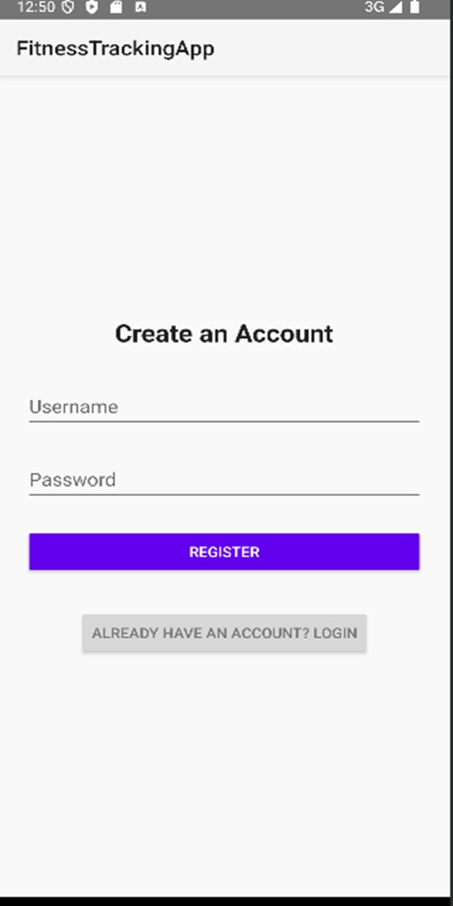
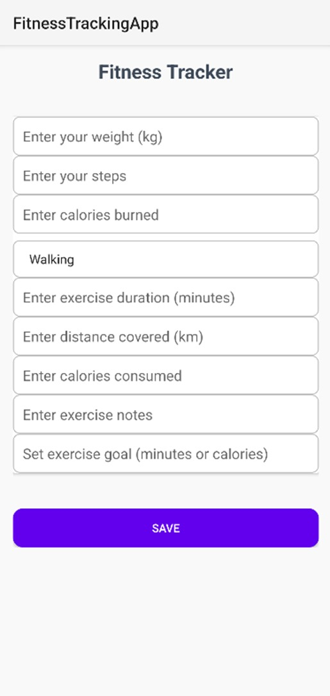
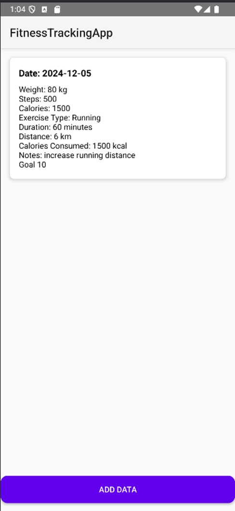

# Fitness Tracking App

A simple native Android application for basic fitness tracking, featuring authentication, data entry, and dashboard views. This app was developed as a university project to demonstrate core Android development concepts and practical use of databases and user interfaces.

---

## Features

1. **Authentication:**
   - User registration and login functionality with secure credential storage.
   - Session management using `SharedPreferences`.

2. **Fitness Data Tracking:**
   - Allows users to log fitness details such as weight, steps, calories burned, exercise type, duration, distance covered, calories consumed, notes, and fitness goals.
   - Displays recently logged data in a dashboard view.

3. **Dashboard:**
   - Presents a summary of fitness data, ordered by the most recent entries.
   - Uses `RecyclerView` for efficient data presentation.

4. **Data Storage:**
   - All user data is stored locally using SQLite for persistence.

---

## Components Used

1. **UI Components:**
   - `EditText` for user input fields.
   - `Spinner` for exercise type selection.
   - `RecyclerView` for displaying data.
   - `CardView` for a clean and modern UI.
   - `Button` for interactive actions like saving and navigation.

2. **Data Management:**
   - SQLite database for storing user data.
   - `SharedPreferences` for lightweight storage of user authentication and session data.

3. **Navigation:**
   - Intents for screen transitions between Login, Register, Data Entry, and Dashboard activities.

4. **Validation:**
   - Input validation to ensure user data is accurate and complete.

---

## Libraries and Tools

- **SQLite:** Built-in database for local data persistence.
- **SharedPreferences:** For storing user session and preferences.
- **Android Studio:** IDE for app development.
- **Java:** Programming language used for app logic.

---

## Screenshots

    
    
    

---

## Contributing

This project was developed for educational purposes. Contributions and suggestions are welcome! Please fork the repository and create a pull request for any changes.

---

## License

This project is licensed under the MIT License. See the LICENSE file for details.

